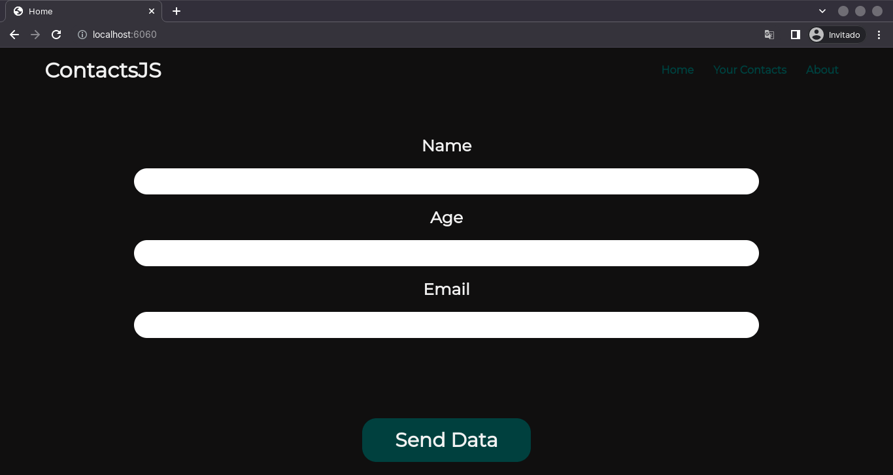

# This is my new Project so NodeJS and MySQL

## It is a project written mostly in javascript but it uses a database to store contact data that you enter in the home, where you can delete them, all the data is shown in the Your Contact directory, I put a lot of effort into this project, I hope what they like.

* ## [LICENSE](LICENSE.md)
* ## [SOURCE](SOURCE.md)
* ## [INSTRUCTIONS](INSTRUCTION.md)
